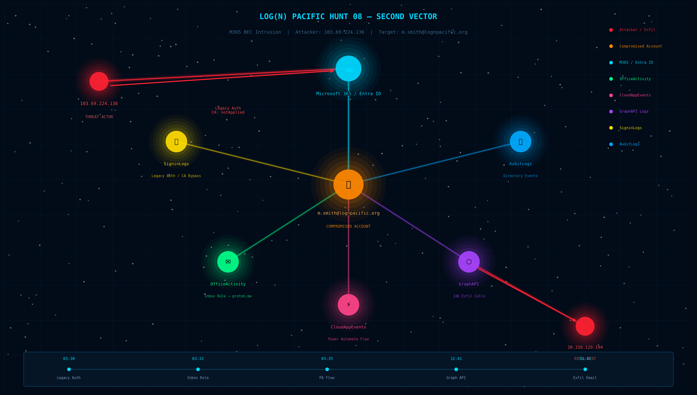

# Threat Hunt Report: LOG(N) Pacific Hunt 08 — Second Vector

> 🌐 **[View Interactive Report](https://noahpageit.github.io/threat-hunt-reports/ThreatHunt08_SecondVector.html)** — Full cyber aesthetic HTML with MITRE ATT&CK mapping, KQL queries, and attack timeline

**Hunt Platform:** hunt.lognpacific.com | **Tenant:** lognpacific.org | **Hunt Window:** June 10–20, 2026 (UTC) | **Analyst:** Crypto



---

## Executive Summary

A Business Email Compromise (BEC) attack targeted finance user `m.smith@lognpacific.org` from external IP `103.69.224.136`. The attacker authenticated via legacy protocols that bypassed Conditional Access, established inbox forwarding rules, planted a malicious Power Automate flow, and abused the Microsoft Graph API to exfiltrate financial data. The attacker IP appeared in **7 distinct log sources** across M365 and Entra ID.

---

## Attack Timeline

```
[June 11 ~03:30 UTC] Auth from 103.69.224.136 via legacy auth
                      ConditionalAccessStatus = notApplied
                      AuthenticationProtocol = none

[June 11 ~03:32 UTC] Inbox forwarding rule created (OWA)
                      Forwards to merovingian1337@proton.me

[June 11 ~03:35 UTC] Power Automate flow created
                      AppId: 7ab7862c-4c57-491e-8a45-d52a7e023983

[June 11 ~12:41 UTC] Flow triggers Graph API exfiltration
                      Destination: 20.150.129.194

[June 11 ~12:41 UTC] Email exfiltrated: "FW: Updated Banking Details..."
```

---

## Key Indicators of Compromise

| Type | Value |
|------|-------|
| Attacker Source IP | `103.69.224.136` |
| Compromised Account | `m.smith@lognpacific.org` |
| Exfiltration Recipient | `merovingian1337@proton.me` |
| Exfiltration Destination IP | `20.150.129.194` |
| Malicious App AppId | `7ab7862c-4c57-491e-8a45-d52a7e023983` |
| Abused Service | Microsoft Power Automate |

---

## Log Source Coverage — 7 Tables

| # | Table | Field | Events |
|---|-------|--------|--------|
| 1 | SigninLogs | IPAddress | 56 |
| 2 | AADNonInteractiveUserSignInLogs | IPAddress | token refresh |
| 3 | AuditLogs | InitiatedBy | directory events |
| 4 | OfficeActivity | ClientIP | 29 |
| 5 | MicrosoftGraphActivityLogs | IPAddress | 146 |
| 6 | CloudAppEvents | IPAddress | 35 |
| 7 | EmailEvents | SenderIPv4 | 1 |

> **Hunt Lesson:** Initial triage missed AADNonInteractiveUserSignInLogs and AuditLogs. Always start with `search "IP"` across all workspace tables before writing targeted queries.

---

## MITRE ATT&CK Mapping

| Tactic | Technique | Detail |
|--------|-----------|--------|
| Initial Access | T1078 — Valid Accounts | Compromised M365 credentials |
| Defense Evasion | T1562 — Impair Defenses | Legacy auth bypassed CA (notApplied) |
| Persistence | T1137 — Office Application Startup | OWA inbox forwarding rule |
| Collection | T1114.003 — Email Forwarding Rule | Mail forwarded to external address |
| Execution | T1651 — Cloud Administration Command | Power Automate flow triggered |
| Exfiltration | T1567 — Exfiltration Over Web Service | Graph API mail read and forward |

---

## Control Gaps & Remediation

**1. Legacy Auth Not Blocked by Conditional Access**
All sign-ins showed `ConditionalAccessStatus = "notApplied"` with `AuthenticationProtocol = "none"` — completely outside CA policy scope.
*Fix: Deploy "Block legacy authentication" CA policy in Entra ID.*

**2. Power Automate Governance Gap**
Attacker created a functional exfiltration flow using compromised delegated permissions. No DLP blocked the external send.
*Fix: Power Platform DLP policy restricting Office 365 Mail connector to internal destinations only.*

**3. Session Persistence After Password Reset**
Active refresh tokens survive password reset — attacker retained access post-remediation.
*Fix: Revoke sessions FIRST (`Revoke-AzureADUserAllRefreshToken`), then reset password.*

---

## KQL Queries

```kql
// Broad IP pivot across all tables
search "103.69.224.136"
| where TimeGenerated between(datetime(2026-06-10T00:00:00Z) .. datetime(2026-06-20T23:59:59Z))
| summarize count() by $table
| order by count_ desc
```

```kql
// Sign-in activity
SigninLogs
| where TimeGenerated between(datetime(2026-06-10T00:00:00Z) .. datetime(2026-06-20T23:59:59Z))
| where IPAddress == "103.69.224.136"
| project TimeGenerated, UserPrincipalName, AppDisplayName,
          ConditionalAccessStatus, AuthenticationProtocol, ResultType
| order by TimeGenerated asc
```

```kql
// Power Automate flow creation
CloudAppEvents
| where TimeGenerated between(datetime(2026-06-10T00:00:00Z) .. datetime(2026-06-20T23:59:59Z))
| where IPAddress == "103.69.224.136" and Application == "Microsoft Power Automate"
| project TimeGenerated, AccountId, ActionType, AppId, IPAddress
```

```kql
// Graph API exfiltration calls
MicrosoftGraphActivityLogs
| where TimeGenerated between(datetime(2026-06-10T00:00:00Z) .. datetime(2026-06-20T23:59:59Z))
| where IPAddress == "103.69.224.136"
| project TimeGenerated, UserId, RequestUri, ResponseStatusCode, IPAddress
| order by TimeGenerated asc
```

```kql
// Inbox rule creation
OfficeActivity
| where TimeGenerated between(datetime(2026-06-10T00:00:00Z) .. datetime(2026-06-20T23:59:59Z))
| where ClientIP startswith "103.69.224.136" and Operation contains "Rule"
| project TimeGenerated, UserId, Operation, ClientIP, Parameters
```

---

## Containment Runbook

1. **Revoke sessions** — `Revoke-AzureADUserAllRefreshToken -ObjectId <UPN>`
2. **Reset password** — only after sessions revoked
3. **Delete inbox rule** — Exchange Online admin center
4. **Disable Power Automate flow** — Power Platform admin, audit all m.smith flows
5. **Block IP** — `103.69.224.136` in Entra ID Named Locations
6. **Enforce MFA** — before re-enabling account access
7. **Block legacy auth** — CA policy targeting all users

---

## Lessons Learned

- `search "IP"` across all tables first — targeted union queries missed 2 of 7 sources
- `ConditionalAccessStatus = "notApplied"` is the legacy auth signal — outside CA scope entirely
- Power Automate with delegated credentials bypasses email DLP — needs Power Platform governance
- Password reset ≠ session revocation — both required for complete containment

---

*LOG(N) Pacific Hunt 08 — Second Vector | hunt.lognpacific.com*
